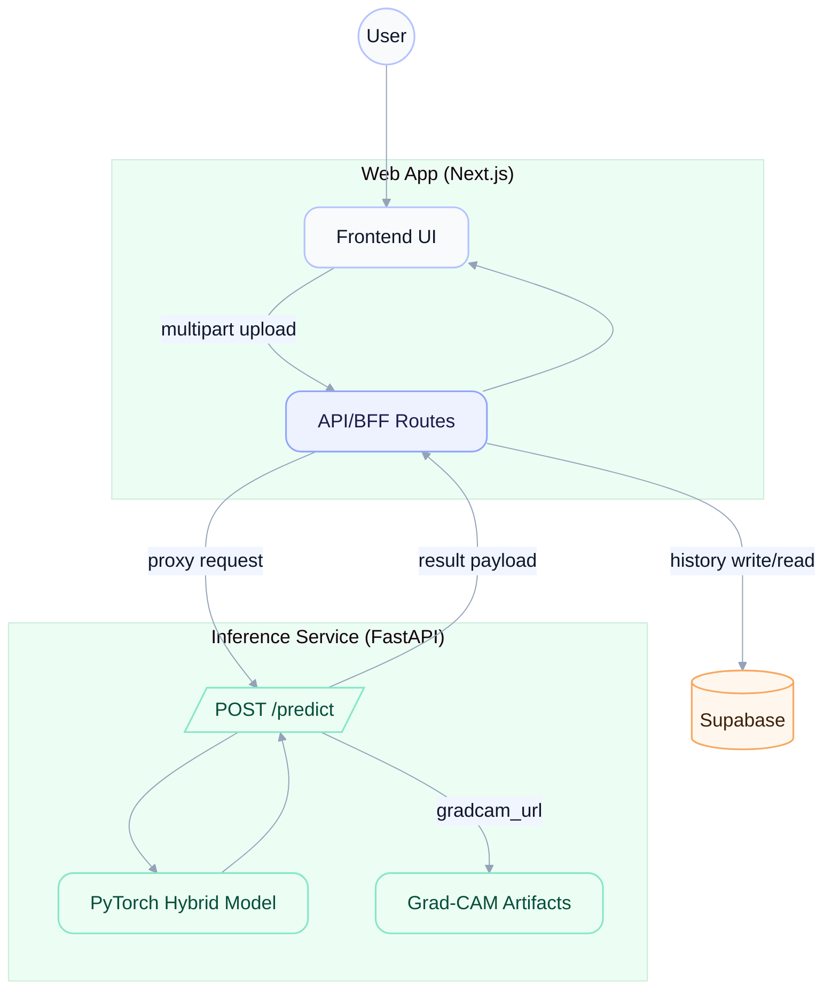

# ClarifyLung-AI

AI-assisted lung X-ray classification with a Next.js frontend and BFF API. The inference service lives in a separate repository, and model weights are stored on Hugging Face. History and user data are stored in Supabase.

## Features
- Image upload with real-time inference results and confidence distribution
- Grad-CAM visualizations returned as URLs
- Inference history and detail views
- Rate-limited API endpoints

## Architecture


## Repository Structure (This Repo)
- `src/` Frontend UI and API routes (Next.js App Router)
- `supabase/` Supabase config and migrations

Inference Service Repo:
- `ClarifyLung-AI-Inference-Service` (separate GitHub repository)
- Weights: `Zenyep/ClarifyLung-AI` on Hugging Face

## API Contract
`POST /predict` (inference service)
```json
{
  "classification": "benign",
  "confidence": 0.9963,
  "probabilities": {
    "normal": 0.0036,
    "benign": 0.9963,
    "malignant": 0.00004
  },
  "gradcam_url": "https://.../static/visualizations/gradcam_xxx.png",
  "attention_url": null
}
```

## Local Development
```powershell
npm install
npm run dev
```

## Deployment

### Frontend/BFF (Next.js)
Set the inference endpoint to your HF Space runtime URL:
```
INFERENCE_API_URL=https://zenyep-clarifylung-ai-inference-service.hf.space/predict
```

## Environment Variables
Frontend/BFF:
- `INFERENCE_API_URL`
- `INFERENCE_API_KEY` (optional)
- `NEXT_PUBLIC_SUPABASE_URL`
- `NEXT_PUBLIC_SUPABASE_ANON_KEY`
- `NEXT_PUBLIC_APP_URL`

Inference service configuration lives in the separate repo and HF Space.

## Notes
This project is for research and demonstration purposes and is not intended for clinical use.
