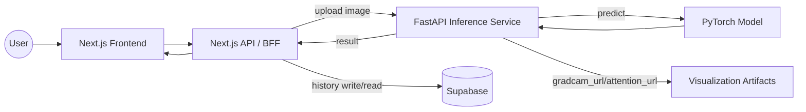

# ClarifyLung-AI Architecture

## Overview
This project delivers a lung X-ray inference flow with a Next.js frontend, a BFF layer for auth/limits/storage, and a FastAPI inference service with visualization output. Results and history are persisted in Supabase.

## Architecture Diagram

## Components
- Frontend: `src/app/[lang]/*` pages render the UI, upload images, and display results and history.
- BFF/API: `src/app/api/inference/*` enforces auth, applies rate limits, normalizes results, and writes to Supabase.
- Inference: `backboned-service/app.py` serves `/predict`, loads the model, and generates visualization artifacts.
- Model: `backboned-service/model.py` defines the hybrid CNN+Transformer architecture.
- Visualization: `backboned-service/visualizer.py` creates Grad-CAM overlays and returns URLs or data URLs.
- Storage: Supabase holds users and inference history; visualization images are served by FastAPI static files.

## Data Flow
1. User uploads an X-ray in the frontend.
2. BFF forwards the image to `POST /predict` in the inference service.
3. Inference returns classification + probabilities + visualization URLs.
4. BFF stores the result in Supabase and returns the response to the UI.
5. UI fetches history and details via BFF routes.

## Deployment Notes
- Inference service should expose `/static` for visualization assets.
- BFF needs `INFERENCE_API_URL` pointing to the inference service.
- Supabase credentials are required in `src/lib/supabase.ts` configuration.

## Environment Variables
Frontend/BFF (Next.js):
- `INFERENCE_API_URL` = `https://<your-fly-app>.fly.dev/predict`
- `INFERENCE_API_KEY` (optional)
- `NEXT_PUBLIC_SUPABASE_URL`
- `NEXT_PUBLIC_SUPABASE_ANON_KEY`
- `NEXT_PUBLIC_APP_URL`

Inference service:
- `ENABLE_VISUALIZATION` (true/false)
- `VISUALIZATION_RETURN_TYPE` (file/data_url)
- `VISUALIZATION_FORMAT` (png)
- `VISUALIZATION_MAX_SIZE` (pixels)
- `VISUALIZATION_OVERLAY_ALPHA` (0-1)
- `VISUALIZATION_PUBLIC_PATH` (default `/static/visualizations`)
- `GRADCAM_TARGET_LAYER` (e.g. `backbone.layer4`)
- `VISUALIZATION_MAX_FILES` (max files to keep)
- `VISUALIZATION_MAX_AGE_HOURS` (max age for cleanup)
- `STATIC_DIR` (static root directory)

BFF (Next.js):
- `INFERENCE_API_URL` (e.g. `http://localhost:8080/predict`)
- `INFERENCE_API_KEY` (optional)
